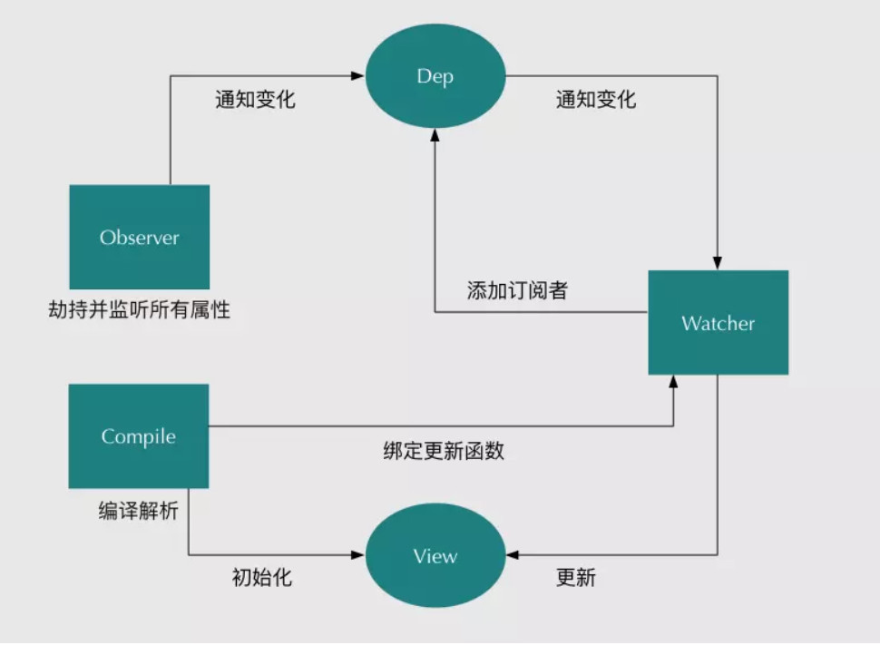

## 目录树
- Complier.js
- Dep.js
- index.html
- main.js
- Observer.js
- Vue.js
- Watcher.js       
- dist
    - main.js

## Vue-model（双向绑定）的原理实现：

## 说明：
- main：入口文件，仿vue式属性编辑
- Vue：自定义的vue模板，根据入口文件所设置的属性进行改变
  + 引入Observer监听绑定数据
  + 引入Complier编译模板
- Dep：订阅者模块
- Watcher：订阅者对象模块
  + 引入Dep模块做判断并添加
- Observer：监听数据模块
  + 引入Dep模块监听订阅者 
- Complier：编译vue模板，处理dom元素，识别 {{}}
  + 引入Watcher判断更新view视图

## 使用方式（假设你已经全局安装webpack）
- $ webpack main.js
- 打开index.html

## 效果
